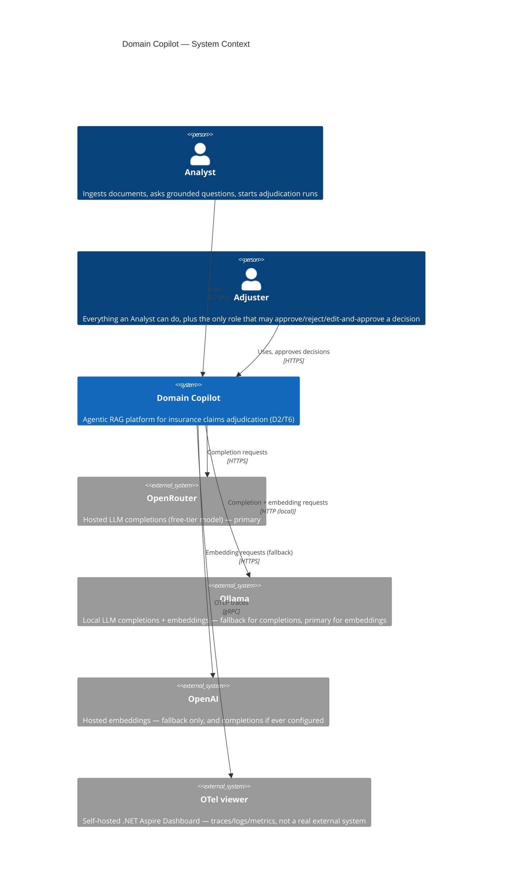
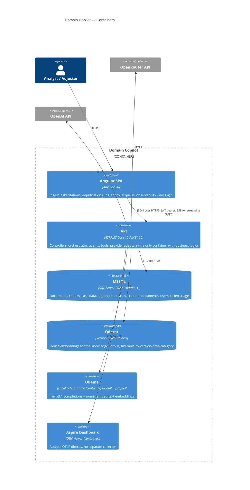
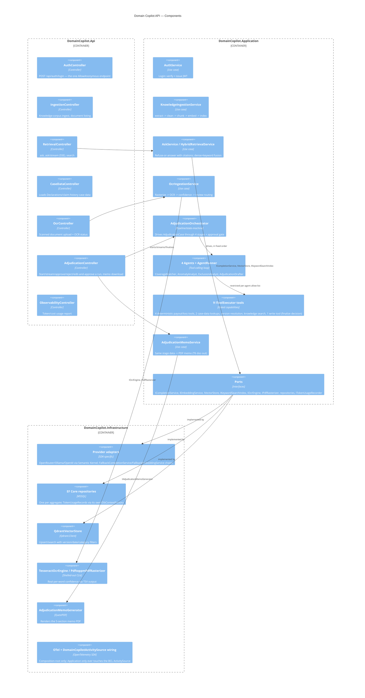
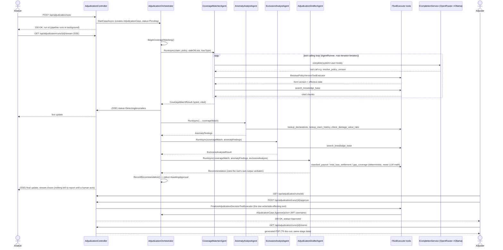
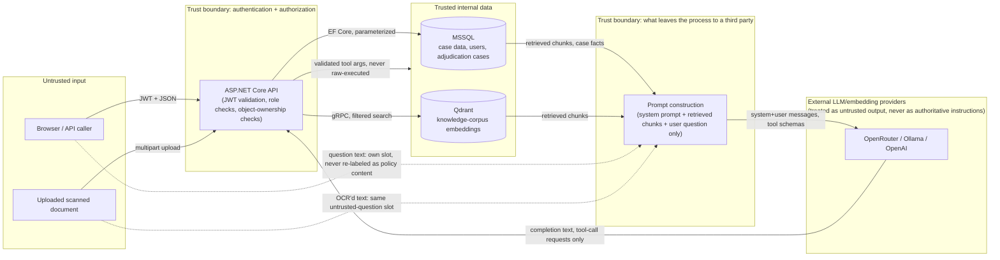
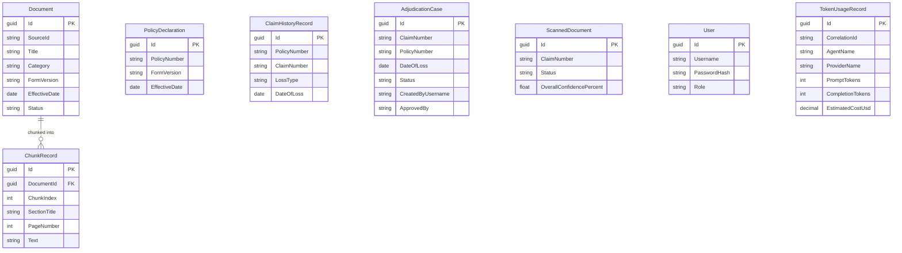
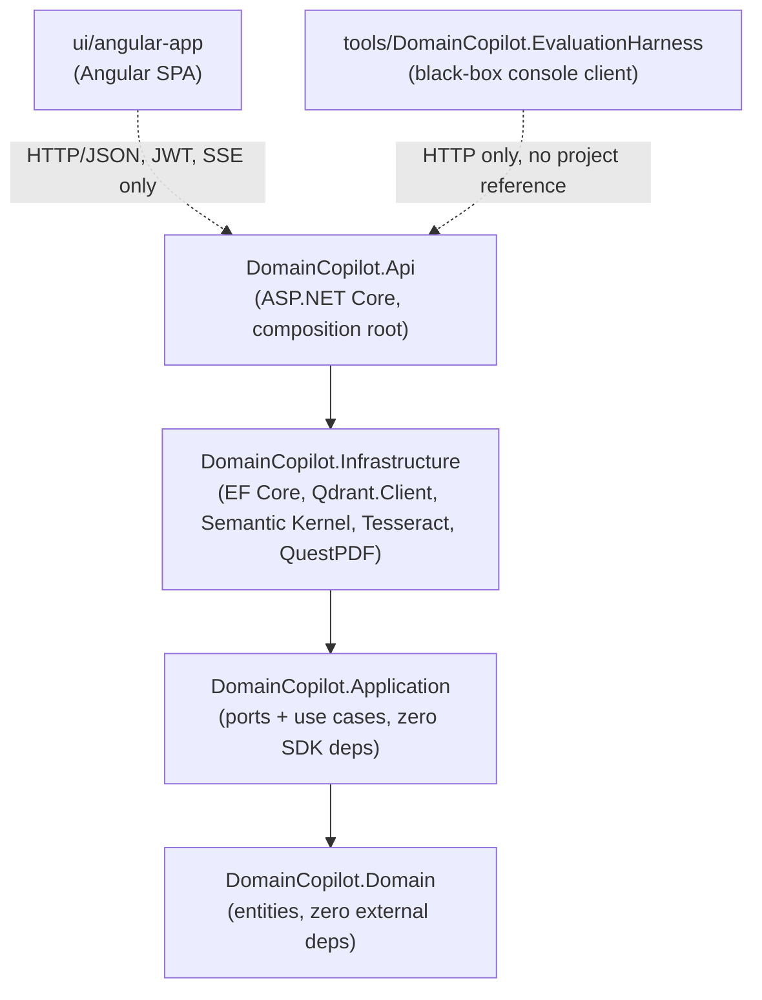

# Architecture — Domain Copilot

**Status**: living document, updated as each epic lands. Diagram source lives in this file (Mermaid, rendered natively on GitHub) — there is no separate rendered-image pipeline to keep in sync.

## 1. C4 Level 1 — System Context

Everything the system talks to outside its own boundary is a commodity LLM/embedding provider (swappable per ADR-0003) or a local observability viewer — there is no third-party insurance system, payment gateway, or identity provider integration, deliberately, since none is in scope for D2/T6.

## 2. C4 Level 2 — Containers

The API is a single ASP.NET Core process — no separate worker/queue container. Background adjudication runs execute as a fire-and-forget `Task` inside the same process against its own DI scope (`AdjudicationController.RunPipelineInBackgroundAsync`), not a separate hosted service or message-queue consumer; see `docs/SYSTEM-DESIGN.md`'s gap table for what a horizontally-scaled version of this would need instead. `api`/`angular-app` have no Dockerfile yet (both run via `dotnet run`/`ng serve` directly on the host in this dev setup) — see the gap table.

## 3. C4 Level 3 — Components (inside the API)

Every arrow crossing the `Application` boundary from `Infrastructure` runs through an interface defined in `Application` — this is the enforced boundary ADR-0001 describes, checked mechanically by the project-reference graph (`Domain`/`Application` have zero references to Semantic Kernel, `Qdrant.Client`, EF Core provider packages, or ASP.NET Core).

## 4. Sequence diagram — the full agentic workflow (FR-4/FR-5/FR-6)

Any per-stage failure (timeout, retry-exhausted completion call, non-conforming JSON) degrades to a plain-RAG summary and marks the case `Failed` rather than leaving it stuck — not shown above for clarity; see ADR-0009's "graceful degrade" section.

## 5. Data-flow diagram — trust boundaries and what the LLM provider sees

What the LLM provider never sees: the JWT signing key, database connection strings, any user's password hash, other users' adjudication cases, or the raw contents of `.env`. What it does see: the corpus text already indexed in Qdrant/MSSQL (synthetic, no real personal data — BR-04), the current user's own question/OCR text, and tool-call results it explicitly requested. The user's own question and any OCR'd document text are placed in their own prompt slot, never concatenated into the "retrieved passages" section a real policy chunk occupies — this is the structural reason a prompt-injection attempt embedded in either can't make itself indistinguishable from real corpus content (see `docs/SECURITY.md`, LLM01).

## 6. Entity-relationship diagram

`PolicyDeclaration`/`ClaimHistoryRecord`/`AdjudicationCase`/`ScannedDocument`/`User`/`TokenUsageRecord` have no foreign keys to each other or to `Document` — case data is looked up by exact key (policy/claim number), never joined or searched (ADR-0004); an `AdjudicationCase` records citations as plain strings inside its stage JSON blobs, not FK references, since a citation identifies a real chunk by title/section/page text, not a database id a human reading the memo needs.

## 7. Layer-dependency diagram

Arrows point inward only, mechanically enforced by the `.csproj` `ProjectReference` graph (ADR-0001) — `dotnet list package` on `Domain`/`Application` shows zero LLM/vector-store/web-framework packages, checked as part of this project's own review discipline, not just asserted.

## 8. Architecture Decision Records

| ADR | Decision |
|---|---|
| [0001](adr/0001-clean-architecture-layering.md) | Clean Architecture over Hexagonal/Vertical Slice, with the inward-dependency rule mechanically enforced |
| [0002](adr/0002-vector-store-qdrant.md) | Qdrant as the vector store |
| [0003](adr/0003-provider-abstraction-fallback-chain.md) | `ICompletionService`/`IEmbeddingService` ports; OpenRouter->Ollama completions, Ollama->OpenAI embeddings |
| [0004](adr/0004-chunking-and-knowledge-vs-case-data-split.md) | Knowledge corpus (chunked/embedded/searched) vs. case data (exact-key lookup only) split |
| [0005](adr/0005-hybrid-retrieval-and-version-aware-filtering.md) | Dense+keyword hybrid retrieval (RRF fusion), version/date-aware metadata filtering |
| [0006](adr/0006-deterministic-payout-calculation.md) | All payout/limit/deductible math is plain, unit-tested C# — never LLM-computed |
| [0007](adr/0007-case-data-foundation-for-agent-tools.md) | Structured case-data tables for the lookup tools, sourced from the corpus generator directly |
| [0008](adr/0008-approval-gate-state-machine.md) | `AdjudicationCase`'s own state machine enforces the human approval gate structurally |
| [0009](adr/0009-multi-agent-orchestrator.md) | Fixed pipeline/state-machine orchestrator (not an open-ended planner) driving 4 agents |
| [0010](adr/0010-ocr-confidence-and-review-routing.md) | T6 OCR: real per-page confidence, `NeedsReview` routing below threshold |
| [0011](adr/0011-generated-adjudication-memo.md) | T6 doc-out: QuestPDF-generated memo from the same stage data as the chat answer |
| [0012](adr/0012-authentication-and-object-level-authorization.md) | JWT auth, two roles, object-ownership checks on adjudication runs |
| [0013](adr/0013-observability-correlation-tracing-and-cost-accounting.md) | Correlation IDs via ASP.NET Core's own Activity, OpenTelemetry tracing, persisted token/cost accounting |

## 9. What's deliberately not shown here

Deployment topology beyond "runs via `docker compose`/`dotnet run` on one host" (no Kubernetes manifests, no multi-region setup) and a full target-state architecture are `docs/SYSTEM-DESIGN.md`'s job, not this document's — this file describes what actually exists and how its pieces fit together, not what a funded, scaled version would look like.
